# VNC-Cliente-Servidor:
## 1. VNC-Windows 10 (TightVNC).
## 1.1 Windows 10 VNC-Server.
- Configuramos la máquina Windows con los parametros adecuados a la práctica

- Descargamos <a href="https://www.tightvnc.com/"> TightVNC </a>, software encargado de realizar las conexiones VNC entre dispositivos compatibles con el protocolo.

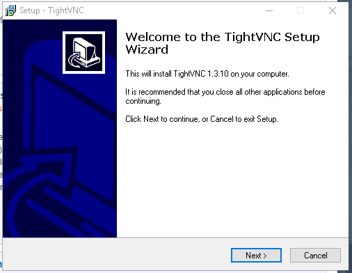

- Elegimos la instalación `TightVNC Server`

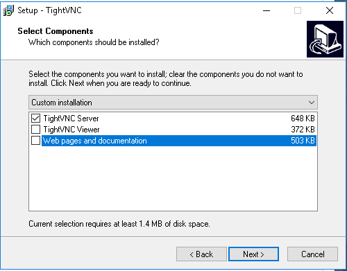

- Iniciamos la aplicación `Launch TightVNC Server`

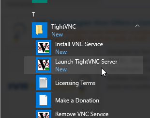

- Al iniciar la aplicación, nos preguntan si queremos establecer contraseña para iniciar la conexión VNC. Por comodida, no se ha establecido, además de no pedir identificación al iniciar sesión, sin embargo, esta decisión no es la más segura.

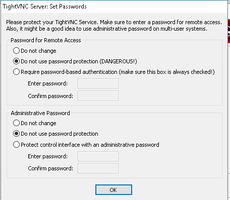

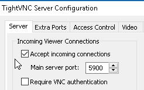

## 1.2 Windows 10 VNC-Viewer.
- Configuración de la máquina e instalación del software anterior.

- Elegimos la instalación `TightVNC Viewer`

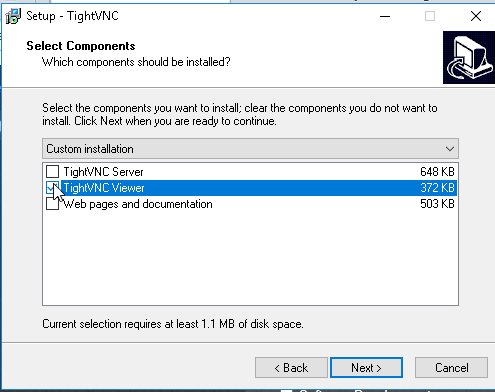

- Ejecutamos la aplicación `TightVNC Viewer`

- Ponemos la IP del servidor VNC `172.18.14.11`.

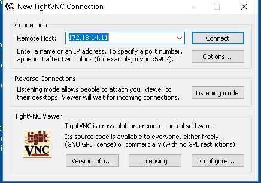

- Acto siguiente, se establece la conexión remota.

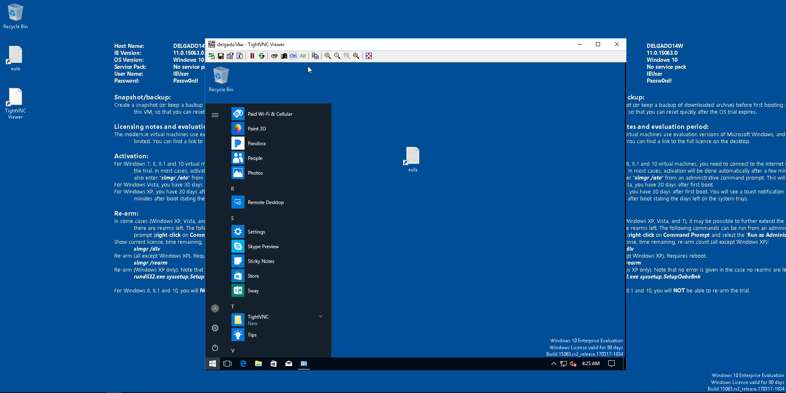

- Ejecutamos el comando `netstat -n` para comprobar la veracidad de la conexión.
~~~
IP de la máquina VNC-Viewer: 172.18.14.12
~~~

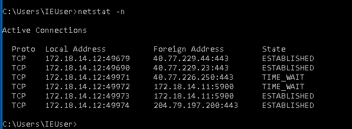

## 2. OpenSUSE VNC.
## 2.1 OpenSUSE VNC-Server.
- Configuramos la máquina OpenSUSE con los parametros adecuados a la práctica
~~~
IP de la máquina: 172.18.14.31
~~~
- Utilizamos `Yast` para instalar el software necesario.

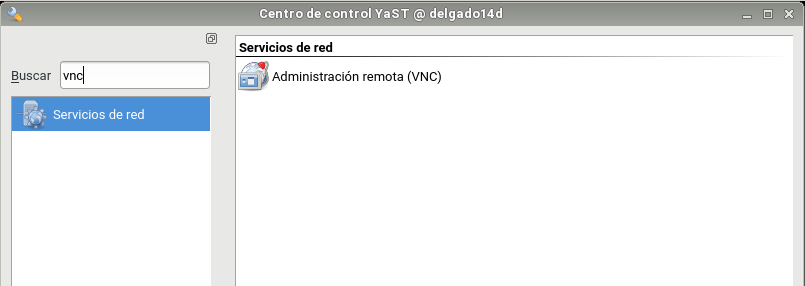

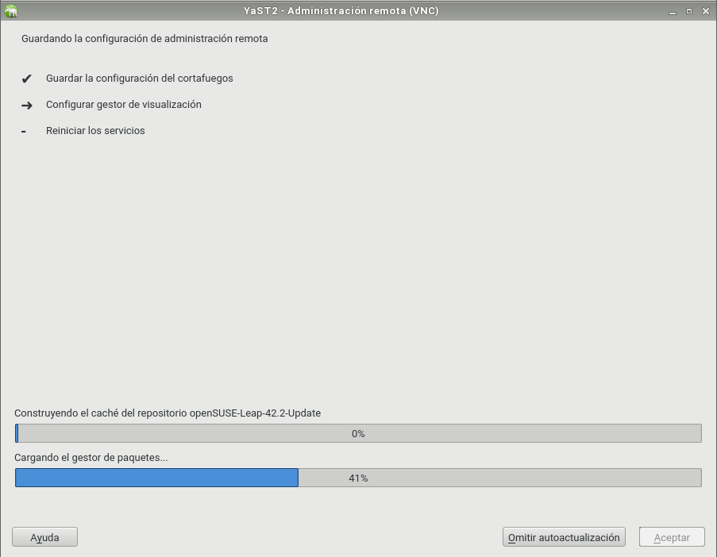

- Ejecutamos la terminal y ponemos el comando `vncserver` y establecemos una contraseña de 6 caracteres mínimos. Esta contraseña será la utilizada para conectarse remotamente al equipo.

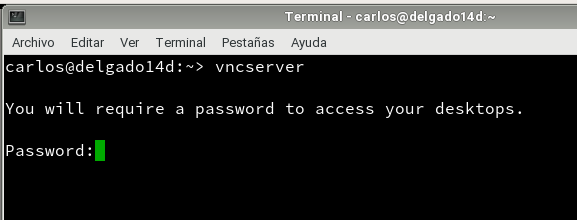

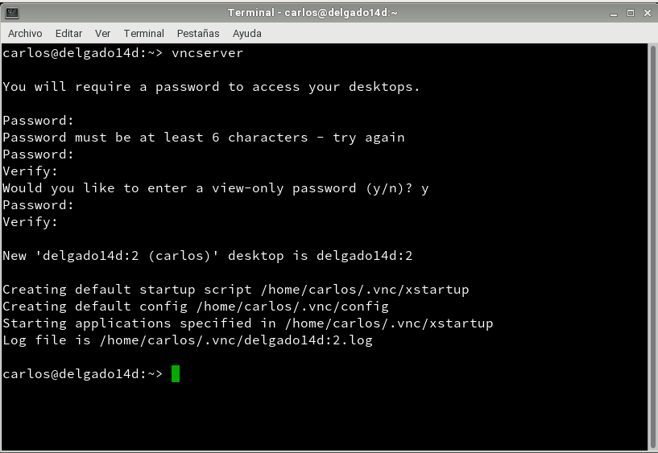

- `delgado14d` representa la máquina con el servidor activo y el numero de puerto  disponible `:2`= `5902`. Si fuera `:3` = `5903`.

## 2.2 OpenSUSE VNC-Cliente.

- Configuramos la máquina OpenSUSE con los parametros adecuados a la práctica
- Ejecutamos el comando `vncviewer` y ponemos la ip del servidor `172.19.14.31` junto al puerto correspondiente `5902`

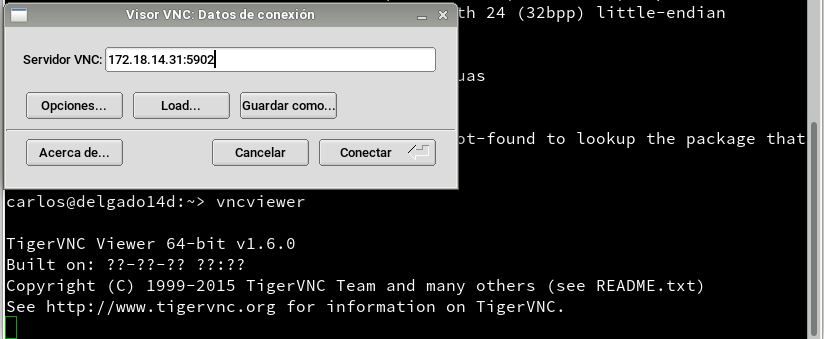

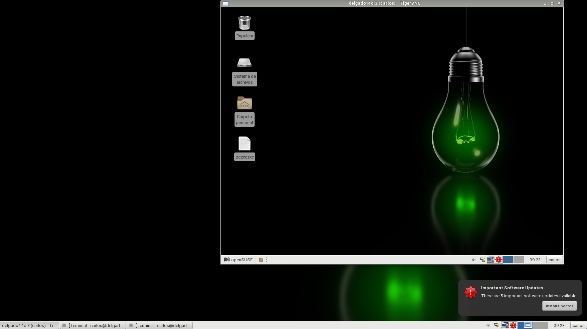

## 3. OpenSUSE y Windows 10 VNC.
  Hacemos la prueba de conexion entre una máquina Windows 10 y una máquina OpenSUSE.
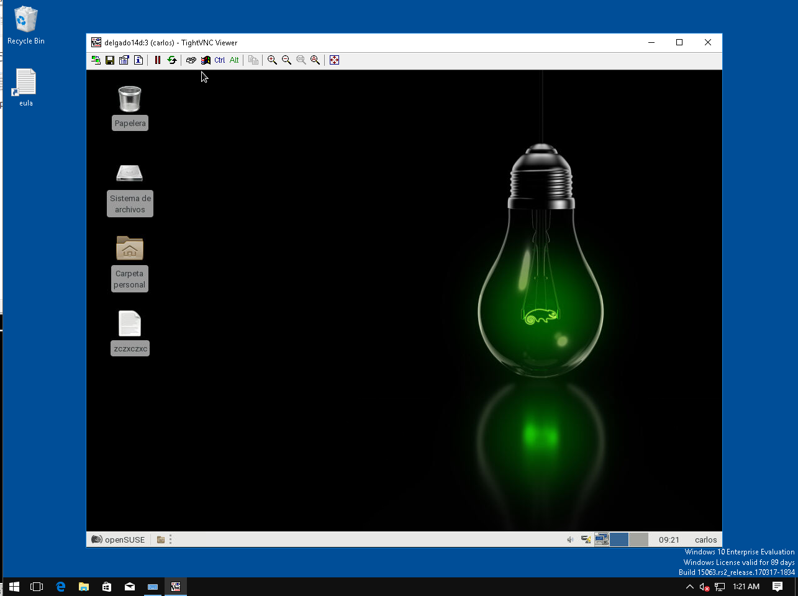
